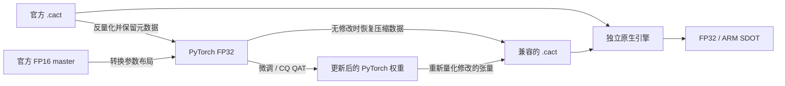

# OpenNeedle

<picture>
  <source media="(prefers-reduced-motion: reduce) and (prefers-color-scheme: dark)" srcset="docs/assets/openeedle-hero-static-dark.svg">
  <source media="(prefers-reduced-motion: reduce)" srcset="docs/assets/openeedle-hero-static.svg">
  <source media="(prefers-color-scheme: dark)" srcset="docs/assets/openeedle-hero-dark.svg">
  
</picture>

**Needle 2 的开放复现：PyTorch 双向转换、量化训练与独立 CPU 推理。**

OpenNeedle 基于公开论文、官方源码和发布权重，实现 Needle 2 的 CQ2/CQ4 混合量化格式与模型前向。你可以将官方模型转为可训练的 PyTorch 模型，重新量化为官方兼容的 `.cact`，或直接使用独立 C++ 引擎运行压缩权重。

[快速开始](#快速开始) · [模型转换](#模型转换) · [实现原理](#实现原理) · [优化策略](#优化策略) · [复现实验](#复现实验) · [参考资料](#参考资料) · [高级用法](docs/usage.md)

## 当前性能

**同一台 4 核 ARM Neoverse-N1 CPU、相同发布模型、3 组工具请求，每组预热后重复 5 次。** 各后端在独立持久进程中串行交错执行；热请求复用固定工具前缀。

| 后端 | 线程 | 解码速度 ↑ | 热请求计算耗时 ↓ |
|---|---:|---:|---:|
| 官方闭源引擎 | 自动 | **407.80 token/s** | **57.7 ms** |
| **OpenNeedle · 原生 FP32** | 4 | **133.24 token/s** | **236.7 ms** |
| **OpenNeedle · SDOT 近似模式** | 4 | **168.21 token/s** | **159.9 ms** |
| PyTorch FP32 参考模型 | 2 | 9.35 token/s | 1803.3 ms |

以上为本轮中位数。原生 FP32 / SDOT 的解码吞吐分别约为 PyTorch 的 **14.2× / 18.0×**；SDOT 达到同轮官方的 **41.2%**，仍有明显差距。PyTorch 的 1/2/4 线程均约 9.2–9.4 token/s，本次使用 CPU eager，未启用 `torch.compile`。

独立路径计入缓存恢复、query prefill、grammar 和 decode，不计预分词、输出解析与首次加载。官方内部工作量及 TPS 定义有所不同，速度比属于应用层比较。首次前缀成本、全部样本与计时边界见 [测速报告](docs/backend-comparison.md)；原始数据见 [backend_comparison.json](reports/backend_comparison.json)。

**默认使用 FP32。** SDOT 会额外舍入激活和码本：64 个位置的诊断中，logits 相对 L2 误差为 0.335%，top-1 一致率为 62/64。本轮速度回归中，各后端 15/15 次调用正确，所有独立路径的生成 token 一致；这不代表完整任务精度已经与官方对齐。

## 快速开始

需要 **Python ≥ 3.10**。原生后端还需要支持 **C++17 和 OpenMP** 的编译器；已实测 Linux ARM64，SDOT 额外要求 CPU 支持 DotProd 指令。

首次获取项目并运行；已在仓库根目录时跳过前两行：

```bash
git clone https://github.com/chamsechan/OpenNeedle.git
cd OpenNeedle
python3 -m venv .venv
source .venv/bin/activate
python -m pip install -e .

# 首次准备模型；已有 artifacts/official/needle2.cact 时可跳过
python scripts/download_official.py

# 独立原生推理：默认 FP32、工具 schema 约束
python -m needle2 run artifacts/official/needle2.cact \
  --tools examples/tools.json \
  --prompt 'Turn on the kitchen light.' \
  --backend native --threads 4
```

输出 JSON 中的 `function_calls` 应包含：

```json
[{"name": "set_light", "arguments": {"room": "kitchen", "on": true}}]
```

首次原生调用会编译随包提供的 C++ 源码并缓存到 `~/.cache/needle2`。推理命令生成工具调用，不执行工具；无需加载官方闭源库。模型、构建产物和本地缓存不随源码分发，下载器固定官方发布版本。

切换后端只需调整参数：

| 用途 | 参数 | 说明 |
|---|---|---|
| 原生 FP32 | `--backend native --threads 4` | 默认数值路径，压缩权重直接参与计算 |
| ARM SDOT | `--backend native --matmul sdot --threads 4` | 更快的近似模式，增加 INT8 舍入 |
| PyTorch 参考 | `--backend torch --threads 1` | 支持直接读取 `.cact` 或转换后的模型目录 |

线程数需按目标 CPU 重新选择。混合 prefill、前缀缓存、训练与 Python API 见 [使用指南](docs/usage.md)。

## 模型转换

```bash
# 官方部署权重 → PyTorch FP32 safetensors
python -m needle2 to-torch \
  artifacts/official/needle2.cact artifacts/pytorch

# PyTorch → 官方兼容的 CQ2.2 .cact
python -m needle2 quantize \
  artifacts/pytorch artifacts/roundtrip.cact

# 检查模型结构、量化位宽和文件哈希
python -m needle2 inspect artifacts/roundtrip.cact
```

也可使用独立脚本：[convert_to_pytorch.py](scripts/convert_to_pytorch.py) 和 [quantize_to_cact.py](scripts/quantize_to_cact.py)。

训练建议从官方浮点 master 开始：

```bash
python -m needle2 to-torch artifacts/official/checkpoints/needle2.pkl \
  artifacts/pytorch_master --template artifacts/official/needle2.cact
python -m needle2 quantize artifacts/pytorch_master artifacts/from_master.cact
```

转换目录包含 `weights.safetensors`、`config.json` 和 `source.cact`。后两者保存模型结构、tokenizer、码本与原始压缩数据，必须随权重一起保留。**未改动的张量恢复原始压缩字节；修改过的张量重新执行 CQ 量化。** 从发布模型转换不会恢复量化前的 master 精度，转换器面向相同 Needle 2 架构。

可训练模型使用普通 `nn.Module` 接口：

```python
import torch
from needle2.convert import load_torch_model

model = load_torch_model("artifacts/pytorch_master")
logits = model(torch.tensor([[2, 4, 123, 5]]))  # [batch, time, 8192]
# 像普通 PyTorch 模型一样计算 loss、反向传播并更新参数。
```

[finetune.py](scripts/finetune.py) 提供监督微调与 `--qat` 入口；保存、重新导出及训练数据格式见 [使用指南](docs/usage.md)。

## 实现原理

### 发布架构与执行路径

实现规格来自锁定的官方 `architecture.py`、`quantize.py`、`export.py` 和 `decode.py`。发布模型包含 **27 层、512 维隐藏状态、8 个 Q heads / 4 个 KV heads、四路 mHC 和 Hadamard MLP**；Engram 注入层的索引为 **2、15（从 0 开始）**。SAN 论文提供设计背景，完整发布架构以源码和模型文件为准。



### CQ2.2 量化与压缩计算

**“2.2”是混合权重位宽，不是 2.2B 参数。** 发布文件包含 43,634,423 个部署参数，采用 `embedding=4,mhc=4,default=2`、128 维分组。量化码字的加权位宽约为 2.255 bit；加入 FP16 norms 和高精度小张量后，数值 payload 为 2.494 bit/weight。完整文件为 13,737,807 字节。[格式与统计](docs/research.md)

对一个非零权重分组，令 `H` 为归一化 Hadamard 矩阵，`C` 为文件内嵌的非均匀 Lloyd-Max 码本：

```text
r     = H w
n     = ||r||₂
qᵢ    = argminⱼ |rᵢ / n − Cⱼ|
w_hat = FP16(n) · Hᵀ C[q]

w_hatᵀ x = FP16(n) · C[q]ᵀ (H x)
```

最后一式让引擎只变换一次输入、直接对 packed codes 查表并累加，避免每次前向展开完整权重。实际导出显式处理零组、padding、码本边界与 FP16 norm 舍入；读取时采用文件内嵌码本。

### 关键实现约定

| 模块 | 实现要点 | 代码 |
|---|---|---|
| CACT 与转换 | 校验目录、shape、位宽与边界；按架构顺序命名；将 Flax `[in,out]` 转为 `[out,in]` | [archive.py](needle2/archive.py)、[convert.py](needle2/convert.py) |
| Attention | GQA、zero-centered RMSNorm、前后半维配对的 RoPE、输出门控、固定前缀与滑动窗口 | [model.py](needle2/model.py) |
| mHC / Engram | 四路状态、20 轮 Sinkhorn；uint32 散列、n-gram 查表和因果卷积历史 | [model.py](needle2/model.py)、[engine.cpp](needle2/csrc/engine.cpp) |
| CQ / QAT | 非均匀码本、Hadamard、LSB-first 打包、FP16 norms、straight-through 梯度 | [quantize.py](needle2/quantize.py)、[qat.py](needle2/qat.py) |
| 工具约束 | tokenizer 与增量 grammar 共同限制合法 token；支持声明过的 schema 子集 | [tokenizer.py](needle2/tokenizer.py)、[grammar.py](needle2/grammar.py) |

## 优化策略

| 策略 | 作用 | 数值或内存代价 |
|---|---|---|
| 输入变换与投影融合 | Q/K/V/gate 共用 Hadamard 结果及线程区，减少重复工作 | 保持 FP32 运算；归约顺序可能不同 |
| packed CQ + NEON | 直接读取压缩码字，embedding/Engram 只解码命中的行 | 大矩阵保持压缩；小型 mHC routing 加载时展开为 FP32 |
| 按形状启用 FP32 查表 | 合适的 CQ2 投影使用每线程 32 KiB activation lookup table | 默认仅在满足形状、分组和线程条件时启用 |
| SIMD Sinkhorn 与共享 KV 读取 | 正数域完成 20 轮归一化，共用 GQA 的 K/V 读取，并缓存 RoPE | 向量指数近似与 FP32 舍入；高动态范围回退 log-space |
| ARM SDOT | 旋转后的激活及码本缩放到 INT8，再用 dot-product 指令累加 | 额外量化误差，必须显式启用；KV 仍为 FP32 |
| 前缀缓存与按需词表投影 | 固定工具描述只预计算一次，跳过不需要的 prefill logits | 快照额外保存前缀 KV 和 Engram 状态 |
| PyTorch 批量 prefill | 批量计算初始 prompt，再交给 native decode | 额外保留约 175 MB FP32 权重 |

具体启用条件、缓存 API 和原始优化实验见 [原生引擎说明](docs/native-engine.md)。这些策略分别验证，单矩阵加速比不直接代表整网提速。

## 精度与复现状态

| 检验 | 已验证结果 | 证据 |
|---|---|---|
| 未修改模型的 `.cact → PyTorch → .cact` | 文件逐字节一致 | [validation.json](reports/validation.json) |
| 官方 FP16 master 独立重新量化 | 与发布文件仅差 4 个字节；官方库加载后的 3 组调用语义一致 | [conversion_parity.json](reports/conversion_parity.json) |
| PyTorch → 原生 FP32 | 192 个位置 top-1 全部一致；最大 logits 误差约 0.000275 | [validation.json](reports/validation.json) |
| 固定 15 项质量案例 | 官方、原生 FP32、SDOT 均正确 13 项；两个独立模式生成序列一致 | [quality.json](reports/quality.json)、[quality_sdot.json](reports/quality_sdot.json) |
| 测试与安装 | 61 项测试、4 项子测试通过；wheel 在独立环境安装并重新编译验证 | [pytest.txt](reports/pytest.txt)、[wheel_install.json](reports/wheel_install.json) |

默认原生路径以公开 FP32 参考计算为目标；公开 C ABI 不提供 logits 导出，无法直接证明与闭源整数引擎逐元素一致。15 项质量案例是小型回归，区别于上方 3 组请求 × 5 次的速度测试；完整 BFCL、官方置信度校准、自动工具检索及全部 grammar 行为尚未复刻。详细边界见 [实测报告](docs/results.md) 和 [grammar 支持范围](docs/grammar.md)。

## 复现实验

安装测试依赖并运行数值验证：

```bash
python -m pip install -e '.[test]'
OPENBLAS_NUM_THREADS=1 OMP_NUM_THREADS=1 python -m pytest -q
python scripts/validate.py
python scripts/validate_sdot.py  # 需要 ARM DotProd
```

准备官方基线库，再复现首页的同轮对比：

```bash
python scripts/benchmark_official.py --fetch-library --repeat 1
OPENBLAS_NUM_THREADS=1 OMP_NUM_THREADS=1 python scripts/benchmark_backends.py \
  --native-threads 4 --torch-threads 1,2,4 --repeat 5 \
  --output reports/backend_comparison.json
```

官方库仅由明确的比较脚本使用。测速应串行运行，避免与编译、训练或其他 CPU 密集任务重叠；报告记录模型/源码哈希、线程配置、全部样本和运行负载。可选 JAX oracle、质量评估及更细的 kernel 测量见 [使用指南](docs/usage.md)。

## 参考资料

以下资料分别用于实现规格、设计背景和工程参考。**具体模型结构、码本、参数化和文件布局以锁定的 Needle 源码与发布模型为准。**

| 资料 | 在 OpenNeedle 中的用途 |
|---|---|
| [Needle 官方源码 · `53df049`](https://github.com/cactus-compute/needle/tree/53df049c4a1a82fca1027b81f9ff21336dfb0861) | 直接实现依据：架构、CQ 数值、CACT/tokenizer 与缓存前向 |
| [Needle 2 官方模型 · `32e9e3a`](https://huggingface.co/Cactus-Compute/needle2/tree/32e9e3a93b205f786929697446ae669cf0a84579) | 配置、部署权重、FP16 master 与官方比较基线 |
| [A Controlled Study of Attention-Only Transformers](https://arxiv.org/abs/2607.18363v1) | SAN 架构研究背景；完整 Needle 2 发布规格还包含源码中的扩展 |
| [Cactus Quants](https://github.com/cactus-compute/cactus/blob/09cb35ab29aaad66189615192d27d84bebbc0522/docs/cactus_quants.md) / [公开 CQ kernels](https://github.com/cactus-compute/cactus/blob/09cb35ab29aaad66189615192d27d84bebbc0522/cactus-kernels/src/matmul.cpp) | activation 侧 Hadamard、分组缩放、查表和 ARM SDOT 的工程参考；这不是 Needle 闭源库源码 |
| [mHC: Manifold-Constrained Hyper-Connections](https://arxiv.org/abs/2512.24880v2) | 多路残差流和双随机 routing 的背景；具体参数化采用 Needle 源码 |
| [Conditional Memory via Scalable Lookup: A New Axis of Sparsity for Large Language Models](https://arxiv.org/abs/2601.07372v2) | Engram 的 n-gram 条件存储背景；散列、表尺寸和注入层采用发布配置 |
| [QuIP#: Even Better LLM Quantization with Hadamard Incoherence and Lattice Codebooks](https://arxiv.org/abs/2402.04396v2) | Hadamard 与低比特码本量化的背景；本项目使用 CQ 标量码本，不采用 QuIP# 的 E8 向量码本 |
| [LUT-GEMM: Quantized Matrix Multiplication based on LUTs for Efficient Inference in Large-Scale Generative Language Models](https://arxiv.org/abs/2206.09557v4) | 查表计算与减少反量化开销的背景；其 GPU 性能结论不作为本项目 CPU 结果 |

公式推导、文件布局、公开参考与生产数值差异详见 [研究记录](docs/research.md)。

## 文档与项目结构

| 入口 | 内容 |
|---|---|
| [使用指南](docs/usage.md) | Python API、训练/QAT、缓存、probe、产物清单与扩展验证 |
| [原生引擎](docs/native-engine.md) | 内核布局、平台能力、快照与实验开关 |
| [同轮速度对比](docs/backend-comparison.md) / [精度与历史实验](docs/results.md) | 测量方法、结果和适用边界 |
| [needle2/](needle2/) | Python 模型、转换器、量化、grammar 与独立 C++ 源码 |
| [scripts/](scripts/) / [tests/](tests/) / [reports/](reports/) | 可复现命令、测试与原始证据 |

<details>
<summary>锁定版本与模型校验值</summary>

- 官方源码：`53df049c4a1a82fca1027b81f9ff21336dfb0861`
- 模型仓库 revision：`32e9e3a93b205f786929697446ae669cf0a84579`
- 官方比较库版本：`2.0.4`，各报告另记录实际动态库哈希
- `needle2.cact` SHA-256：`b43aabfcaf1a6db6acf488076eab71d823c08697c7af4521fc1d174b60ede5ba`

</details>

## 许可证

OpenNeedle 源码采用 [Apache-2.0](LICENSE)。上游实现归因见 [NOTICE](NOTICE)；下载的官方权重与基线库保留各自上游许可。官方模型、闭源比较库及大型生成文件不包含在源码包中。
