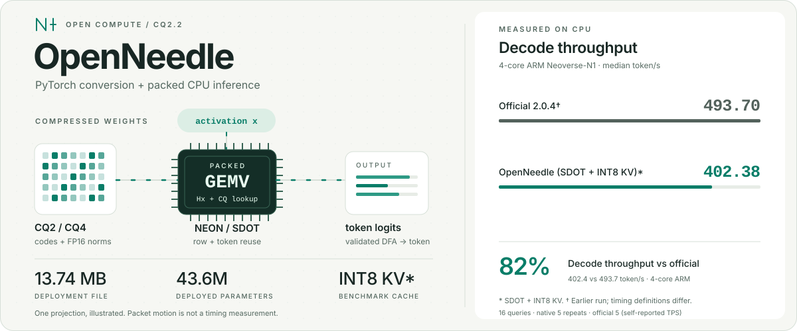

# OpenNeedle

[English](README.md) | **中文**

<picture>
  <source media="(prefers-reduced-motion: reduce) and (prefers-color-scheme: dark)" srcset="docs/assets/openeedle-hero-static-dark.svg">
  <source media="(prefers-reduced-motion: reduce)" srcset="docs/assets/openeedle-hero-static.svg">
  <source media="(prefers-color-scheme: dark)" srcset="docs/assets/openeedle-hero-dark.svg">
  
</picture>

**面向 Needle 2 的开源 CPU 推理引擎与 PyTorch 工具链。**

支持 CQ2/CQ4 压缩权重直接推理、PyTorch 双向转换、微调与 QAT。独立 C++ 引擎提供 FP32 和 ARM SDOT 路径，支持前缀缓存与工具调用约束解码。

[快速开始](#快速开始) · [模型转换](#模型转换) · [编译指南](docs/build.md) · [Agent Skills](#agent-skills) · [文档](#文档)

## 当前性能

最新实测实现：**`f4f9b38`**，4 核 ARM Neoverse-N1，4 线程，**SDOT＋INT8 KV**，使用同一份官方发布权重。下表为中位数；基础和扩展用例集分别含 3、16 个独立请求。

| 指标 | 官方 2.0.4¹ | OpenNeedle 优化后 | OpenNeedle 相对官方 |
|---|---:|---:|---|
| 基础热请求计算耗时 | 45.1 ms | **60.3 ms** | 耗时高 33.6% |
| 扩展热请求计算耗时 | 439.1 ms | **87.4 ms** | 耗时低 80.1% |
| 扩展 query prefill 耗时 | 未公开 | **32.3 ms** | 无法直接比较 |
| 扩展解码吞吐 | 493.7 token/s | **327.4 token/s** | 吞吐低 33.7% |
| 工具调用质量 | 13/15（86.7%） | 13/15（86.7%） | 该样本得分相同 |

¹ 官方数据来自同机较早一轮测量（每例 5 次），优化后数据每例测量 9 次，**并非官方与新版同轮交错测速**。官方 TPS 为自报值，内部工作量与计时范围不同；扩展请求耗时更低不能证明解码内核更快。热请求不含模型加载、前缀准备和 DFA 编译；native 查询分词与最终解析也在计时之外。

在 **`e809ffc` → `f4f9b38` 同轮交错对照**中，扩展请求耗时 **132.8 → 87.4 ms（降低 34.2%）**，query prefill **41.2 → 32.3 ms（降低 21.6%）**，解码吞吐 **201.3 → 327.4 token/s（提升 62.6%）**。每例预热一次、测量 9 次，各版本使用独立常驻进程。[完整方法、原始样本与复现](docs/backend-comparison.md)。

**默认仍为 FP32；SDOT 与 INT8 KV 均为可选近似模式。** 四种原生配置的质量集输出均保持不变。本轮通过 **194 项测试及 4 个子测试**；31 条请求中，每种配置的 1026 × 8192 个完整 logits 均与自身优化前结果逐位一致。这不表示四种配置彼此相同，也不表示与官方 logits 相同。完整 BFCL 尚未评估。详见 [精度验证](docs/results.md) 与 [grammar 支持范围](docs/grammar.md)。

## 快速开始

需要 **Python ≥ 3.10、C++17 编译器及 OpenMP**；已实测 Linux ARM64。SDOT 额外要求 CPU 支持 DotProd。

```bash
git clone https://github.com/chamsechan/OpenNeedle.git
cd OpenNeedle
python3 -m venv .venv
source .venv/bin/activate
python -m pip install -e .

# 下载固定版本的官方模型
python scripts/download_official.py

# 运行工具调用推理
python -m needle2 run artifacts/official/needle2.cact \
  --tools examples/tools.json \
  --prompt 'Turn on the kitchen light.' \
  --backend native --threads 4
```

输出中的 `function_calls`：

```json
[{"name": "set_light", "arguments": {"room": "kitchen", "on": true}}]
```

首次原生调用自动编译并缓存 C++ 内核，无需官方闭源库；可用 `python -m needle2 build-native` 提前编译。CMake 和预编译部署见 [编译指南](docs/build.md)。工具执行由应用接入。

添加 `--matmul sdot --kv-cache int8` 使用性能表中的近似模式；省略这两个选项则使用默认 FP32。仅添加 `--matmul sdot` 会保留 FP32 KV；改用 `--backend torch` 运行 PyTorch 参考后端。线程数按目标 CPU 调整。

## 模型转换

```bash
# 官方部署权重 → PyTorch FP32
python -m needle2 to-torch artifacts/official/needle2.cact artifacts/pytorch

# PyTorch → 官方兼容的 CQ2/CQ4 部署文件
python -m needle2 quantize artifacts/pytorch artifacts/roundtrip.cact

# 检查结构、位宽与哈希
python -m needle2 inspect artifacts/roundtrip.cact
```

转换目录中的 `weights.safetensors`、`config.json`、`source.cact` 应完整保留。未修改张量保留原始压缩字节，修改后的张量重新量化。转换器支持相同 Needle 2 架构。

FP16 master 转换、Python API 与微调/QAT 见 [使用指南](docs/usage.md)。

## 实现与参考

C++ 引擎在 Q/K/V/gate 投影间共享一次 Hadamard 输入变换，直接读取 packed CQ 权重，使用 NEON FMA 或可选 SDOT 整数点积。SDOT 同时计算四个输出行以复用激活加载；普通矩阵运算的输出行数少于 128 时串行执行。权重保持原有压缩行布局，KV 默认使用 FP32，可选按 head 保存尺度的 INT8 缓存；INT8 会引入额外量化误差。

固定工具前缀通过 [NativeEngine 前缀缓存 API](docs/native-engine.md#固定-tools-前缀复用) 复用。native 工具解码将 schema 与 UTF-8 约束编译成 token DFA，只投影合法候选行，单候选时跳过 LM head；大型 grammar 回退到 Python schema 检查。四行内核与单行 SDOT 的逐元素一致测试覆盖 CQ2/CQ4、padding、尾行及 1/2/4 线程。

最新优化在构造时完整验证不可变 DFA，后续请求复用验证结果，同时保留词表检查和原始 C ABI 检查。Attention 复用 GQA 工作列表、KV 槽位映射，并在 32 维 NEON 寄存器分块中累加 V。SDOT prefill 让相邻 token 共享权重解包，每块的 RoPE 三角函数仅计算一次、供所有层复用。这些修改保持既有量化规则和逐维累加顺序；详见 [实现细节](docs/native-engine.md#prefill-与-attention-数据复用)。

模型架构与量化依据固定版本的 [Needle 源码](https://github.com/cactus-compute/needle/tree/53df049c4a1a82fca1027b81f9ff21336dfb0861) 和 [发布权重](https://huggingface.co/Cactus-Compute/needle2/tree/32e9e3a93b205f786929697446ae669cf0a84579)。架构、CQ 格式、Arm 指令与 Cactus 内核参考见 [技术参考](docs/research.md)；执行细节和数值边界见 [原生引擎](docs/native-engine.md)。

## Agent Skills

提供 [安装推理](skills/openeedle-inference/SKILL.md)、[模型转换](skills/openeedle-convert/SKILL.md)、[微调/QAT](skills/openeedle-finetune/SKILL.md)、[性能对比](skills/openeedle-benchmark/SKILL.md) 四个 skills，安装与调用方式见 [Skills 指南](skills/README.md)。

也可直接让助手执行：“读取 `skills/openeedle-inference/SKILL.md`，用我的工具 schema 跑通推理。”

## 文档

| 文档 | 内容 |
|---|---|
| [使用指南](docs/usage.md) | 转换、Python API、训练/QAT 与前缀缓存 |
| [编译指南](docs/build.md) | 自动编译、CMake 与预编译部署 |
| [原生引擎](docs/native-engine.md) | 内核布局、优化策略与平台能力 |
| [性能对比](docs/backend-comparison.md) · [精度验证](docs/results.md) | 测量方法、结果与复现命令 |
| [技术参考](docs/research.md) | 模型架构、量化格式、版本与参考文献 |

## 许可证

源码采用 [Apache-2.0](LICENSE)，上游归因见 [NOTICE](NOTICE)。官方模型与基线库单独下载，遵循各自的上游许可。
